<h1 align="center">👋 I'm Noureddine Saidi</h1>
<h3 align="center">A passionate Software AI Engineer</h3>

  <a href="https://noureddinesaidi.netlify.app/">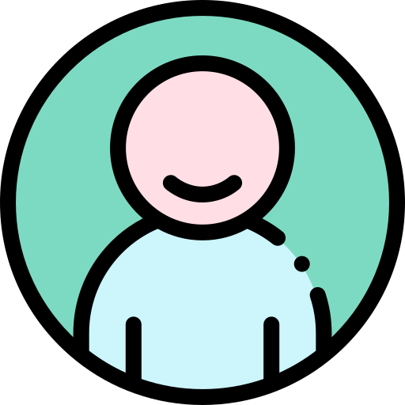</a>
  
  

    

<h3 align="left"> 🛠️ Toolbox</h3>

  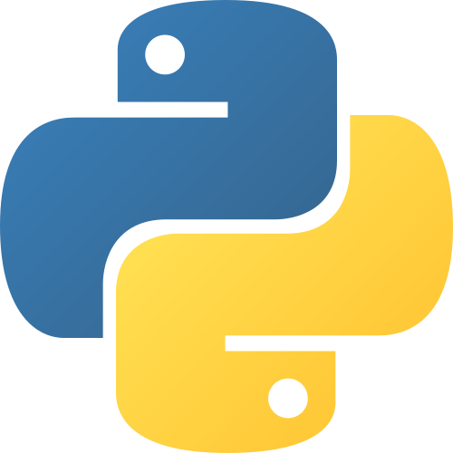
  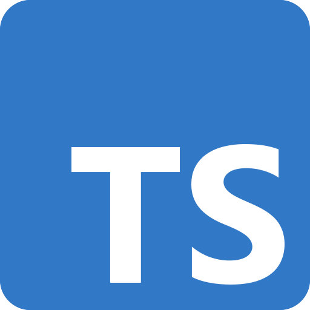
  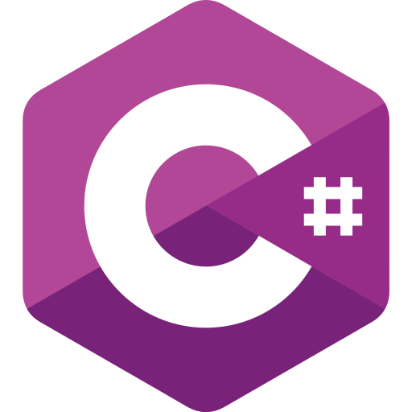
  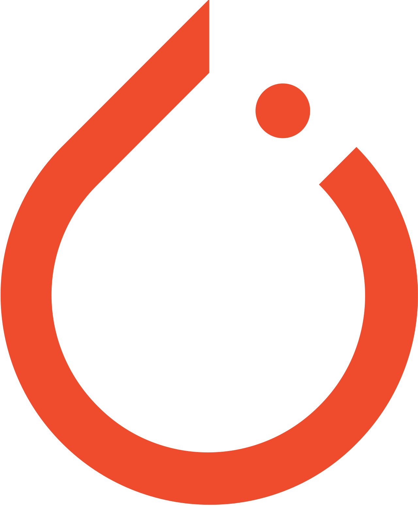
  
  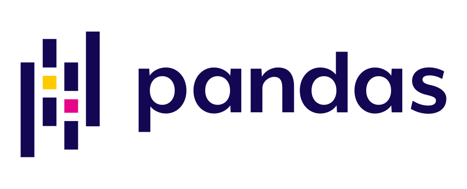
  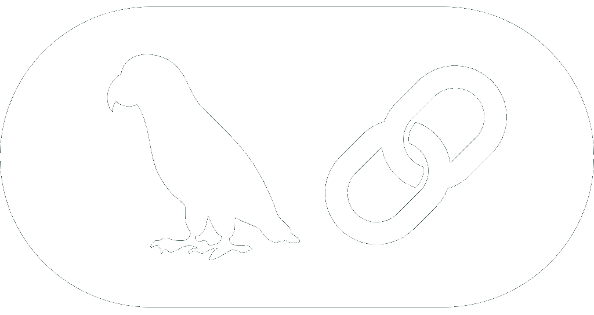
  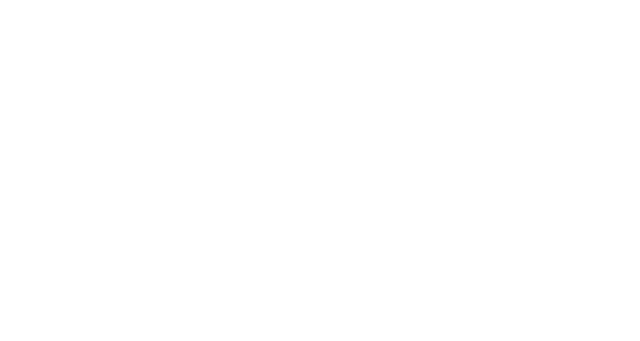
  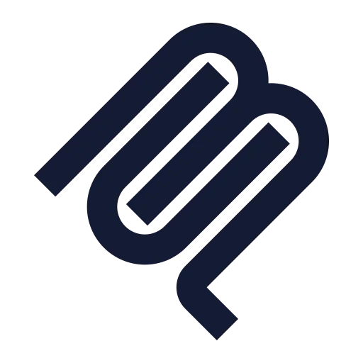
  
  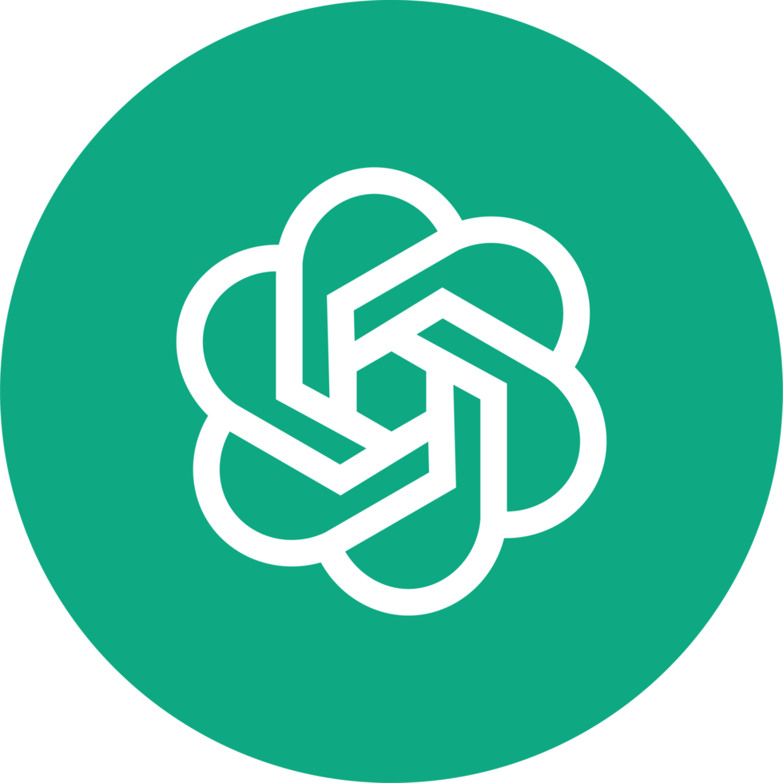
  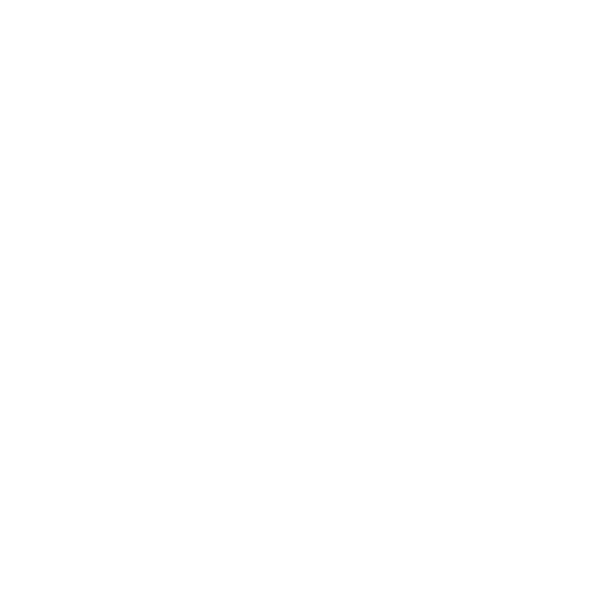
  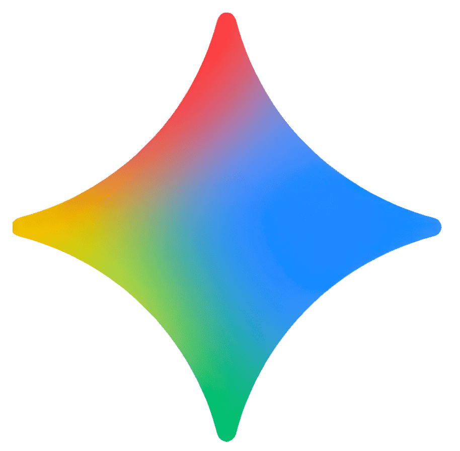
  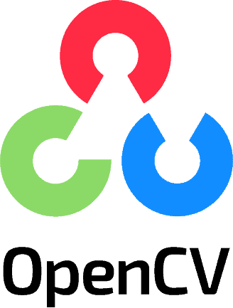
  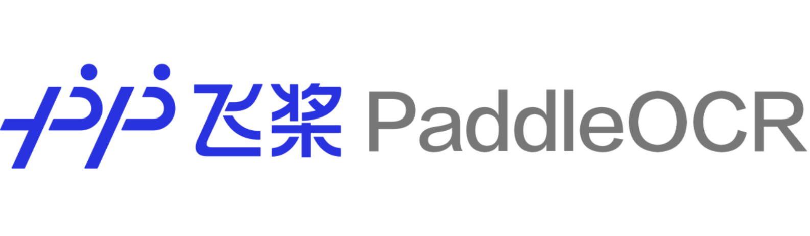
  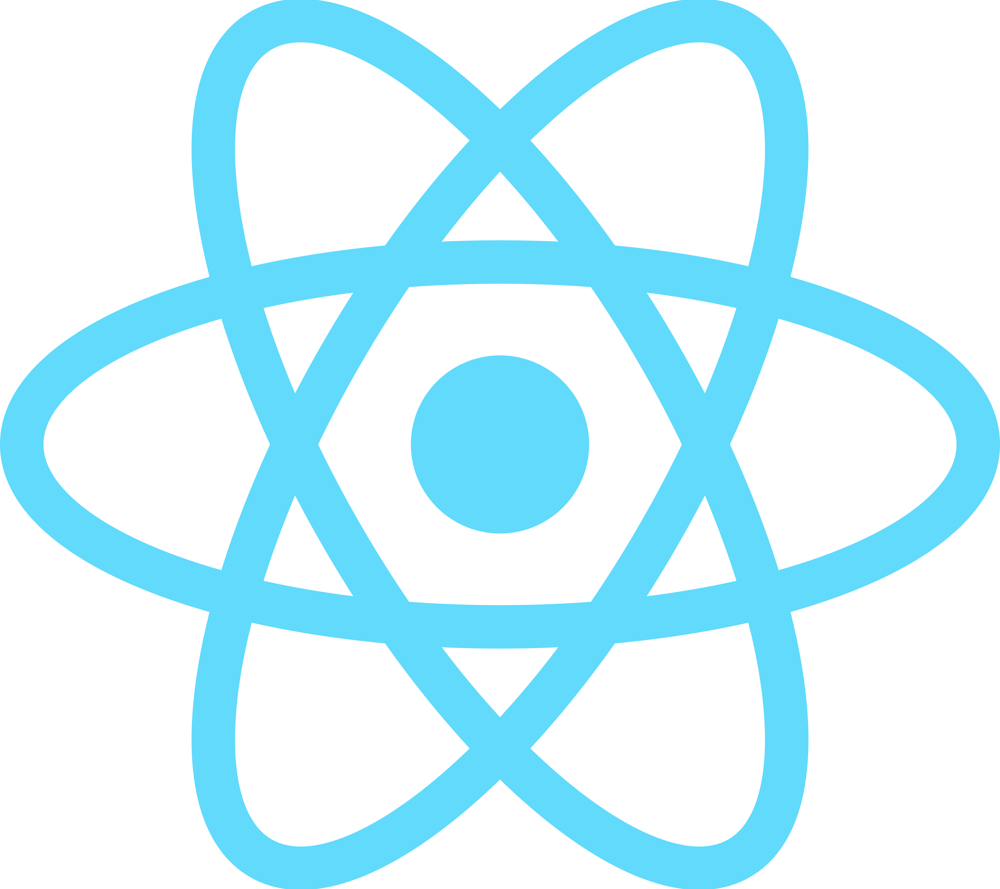
  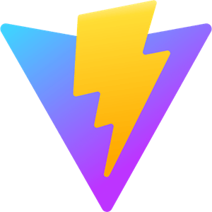
  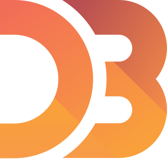
  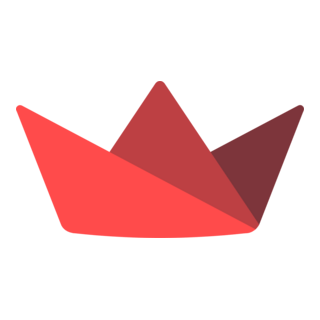
  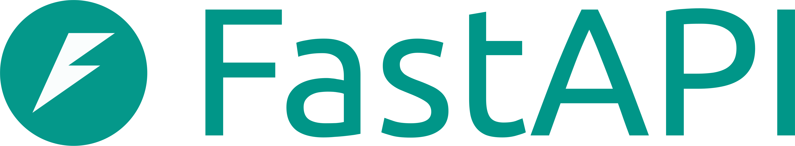
  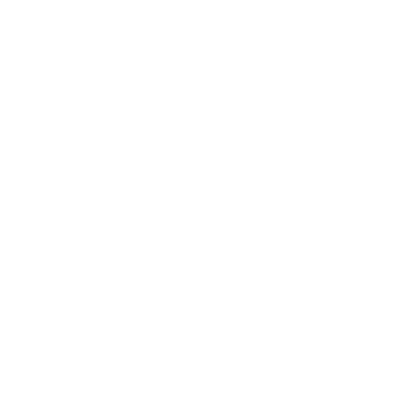
  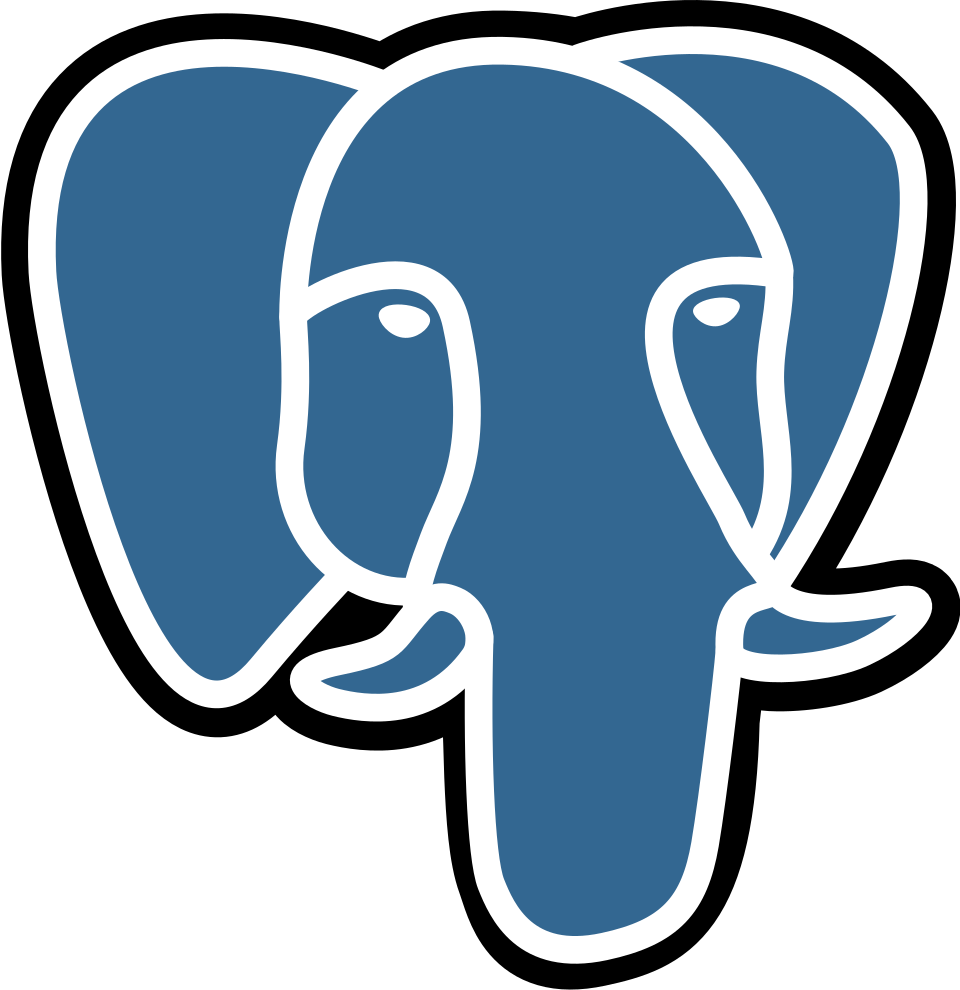
  
  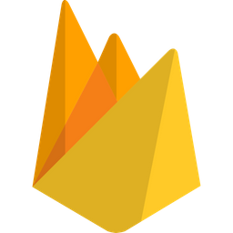
  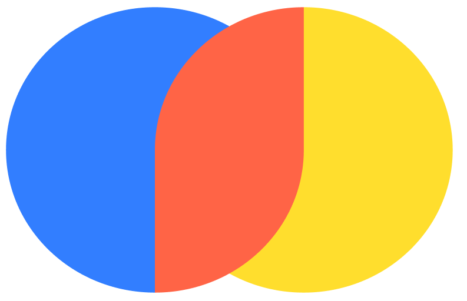
  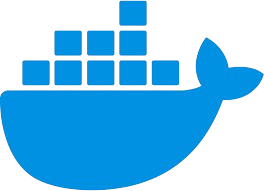
  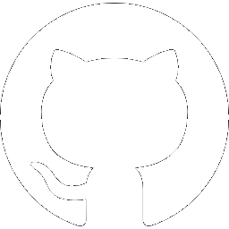
  
  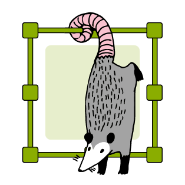
  

&nbsp;

